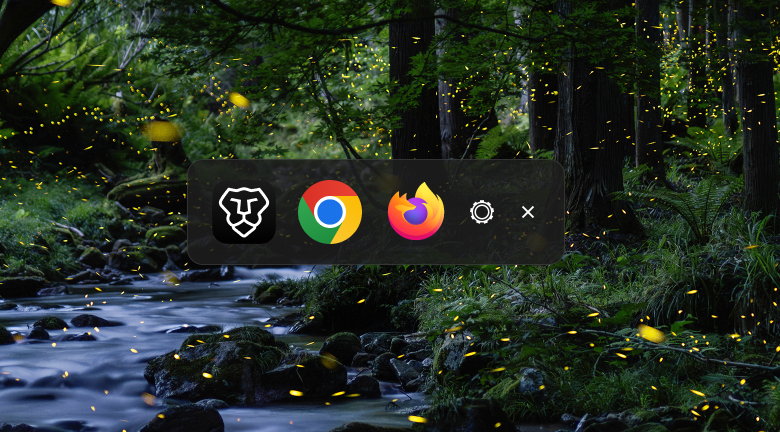
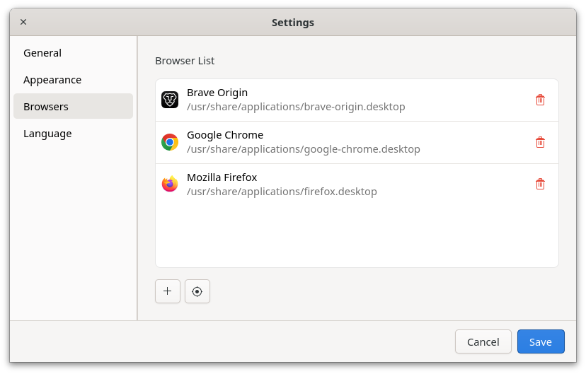
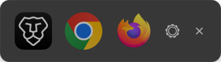

# URL Chooser (GJS + GTK 4.0)

[](https://gjs.guide/)
[](https://www.gtk.org/)
[](LICENSE)

**URL Chooser** is a lightweight intermediary web browser selection utility written in GJS (GNOME JavaScript) and built with the GTK 4.0 toolkit. When clicking a hyperlink from any external app (such as Discord, Slack, or your favorite Terminal), it launches a fast, modern, transparent pop-up panel letting you pick which browser should open that specific link.

---

## 📸 Screenshots

| 1. Main Chooser UI | 2. Settings Dashboard | 3. Browser Management |
| :---: | :---: | :---: |
|  |  |  |

---

## ✨ Features
- 🖥️ **Modern Transparent UI:** Transparent CSS panel setup featuring clean paddings and smooth borders without cluttering your desk background.
- 🔍 **Auto Detect `.desktop` Apps:** Scans `/usr/share/applications` and filters for browsers satisfying the `Network;WebBrowser;` categories automatically.
- 🌐 **Full i18n & Icon Support:** Correctly resolves application display names and standard icons depending on your active operating system locale. Includes quick runtime language toggles (English / Thai).
- ⚙️ **Advanced Preferences:** A native sidebar preferences view for adjustments on Icon Sizes, Themes (Dark/Light/System), and Toggle Prompts that applies modifications globally on the main UI immediately upon saving.
- ⌨️ **Keyboard Friendliness:** Simply hit `Esc` to instantly close out the interactive panel.

---

## 🛠️ System Dependencies

This application is designed for GNU/Linux environments (highly optimized for GNOME Desktop Environments) and relies on GJS alongside GTK4. Please install the appropriate packages for your distribution before running the application:

### 📦 Distro Installation Commands

#### For Debian / Ubuntu / Pop!_OS
```bash
sudo apt update
sudo apt install gjs libgtk-4-dev desktop-file-utils

```

#### For Fedora

```bash
sudo dnf install gjs gtk4-devel desktop-file-utils

```

#### For Arch Linux

```bash
sudo pacman -Syu
sudo pacman -S gjs gtk4 desktop-file-utils

```

---

## 🚀 Installation Guide

The framework gets installed in an isolated directory spacing under `/opt/urlchooser`, populates executable symlinks straight to `/usr/local/bin`, and registers the application icon (`io.github.ixenatt.urlchooser`) into the system's `hicolor` icon theme automatically.

1. Clone this repository locally to your machine:
```bash
git clone [https://github.com/yourusername/urlchooser.git](https://github.com/yourusername/urlchooser.git)
cd urlchooser

```


2. Elevate application install script execution rights:
```bash
chmod +x install.sh

```


3. Trigger execution using root privileges (`sudo`):
```bash
sudo ./install.sh

```


---

## ⚙️ Setting as Default Web Browser

Once configured onto the machine, map your operating system's default HTTP/HTTPS protocol handlers onto URL Chooser.

### Method 1: Desktop Settings Window (GUI)

1. Open your system's **Settings** panel (e.g., GNOME Settings).
2. Navigate to **Default Applications**.
3. Under the **Web** row dropdown, pick **URL Chooser**.

### Method 2: Command Line (CLI)

```bash
xdg-settings set default-web-browser urlchooser.desktop

```

---

## 📂 Architecture Structure

The system installation structure models an isolated execution space under `/opt` with global linking:

```text
/opt/urlchooser/        # Main application boundaries
├── urlchooser.js       # App entry point (orchestrates windows & lifecycle)
├── core.js             # System Core (I/O configuration handlers, desktop file parsers, browser launchers)
├── ui.js               # Theme-aware CSS loader (resolves System/Light/Dark, installs the right stylesheet)
├── ui-dark.js           # Dark theme stylesheet
├── ui-light.js          # Light theme stylesheet
├── theme-detect.js     # Desktop-agnostic system light/dark detection (XDG Desktop Portal + fallbacks)
├── settings.js         # Responsive Multi-page Sidebar dashboard controller
├── image/              # Application screenshots + app icon
│   ├── 1.png
│   ├── 2.png
│   ├── 3.png
│   ├── urlchooser-icon.png       # App icon (rounded corners, transparent background)
│   └── urlchooser-icon-512.png   # 512×512 export for icon theme installation
└── i18n/               # Internationalization module directory
    ├── index.js        # Translation driver core
    ├── en.js           # English resource mappings
    └── th.js           # Thai resource mappings

/usr/local/bin/
└── urlchooser --------> Symlink pointing directly to /opt/urlchooser/urlchooser.js

/usr/share/applications/
└── urlchooser.desktop  # System integration mapping x-scheme-handler/http(s)

/usr/share/icons/hicolor/512x512/apps/
└── io.github.ixenatt.urlchooser.png  # Installed app icon (resolved by GTK application_id)

```

---

## 🏷️ Application Identity

The GTK application is registered under the ID **`io.github.ixenatt.urlchooser`**. This is a standard reverse-DNS `GApplication` ID used internally by GTK for D-Bus registration, single-instance enforcement, and desktop/taskbar window grouping. `install.sh` uses this same ID as the installed icon filename and the `.desktop` file's `Icon=` / `StartupWMClass=` fields, so the desktop environment can correctly associate the app icon with its running window.

---

## 📝 License

This program is free software: you can redistribute it and/or modify it under the terms of the **GNU General Public License** as published by the Free Software Foundation, either version 3 of the License, or (at your option) any later version.

This program is distributed in the hope that it will be useful, but WITHOUT ANY WARRANTY; without even the implied warranty of MERCHANTABILITY or FITNESS FOR A PARTICULAR PURPOSE. See the [GNU General Public License](https://www.google.com/search?q=https://www.gnu.org/licenses/gpl-3.0.html) for more details.

See the [LICENSE](https://www.google.com/search?q=LICENSE) file for the full license text.